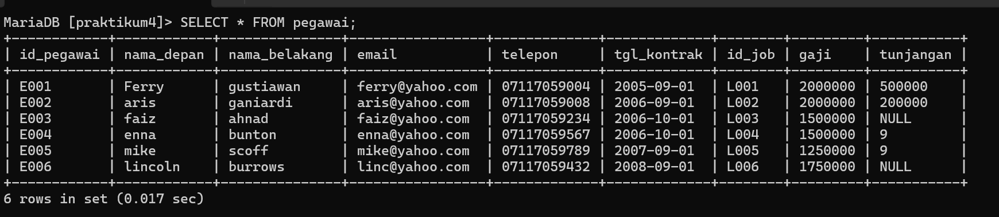
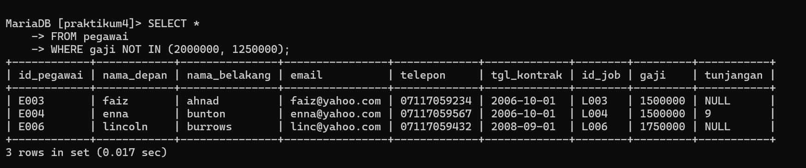
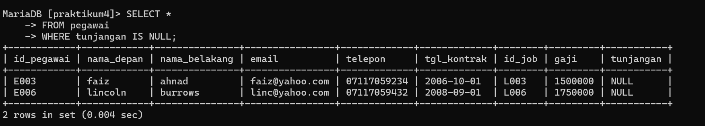
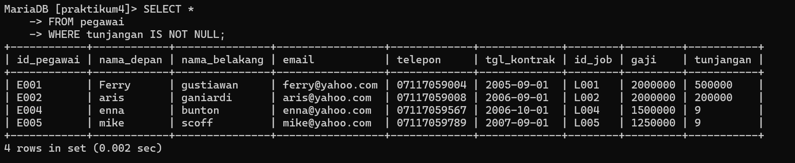
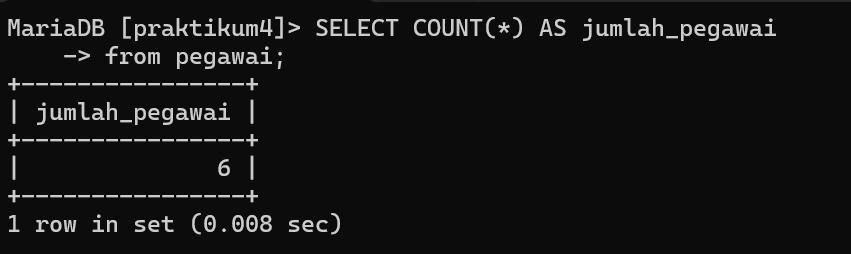
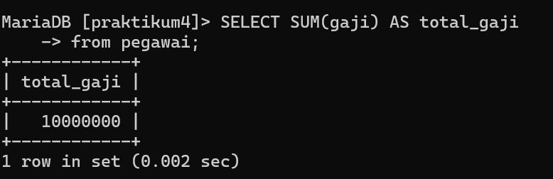
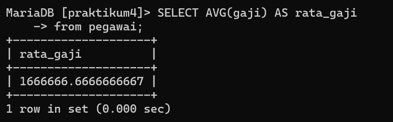
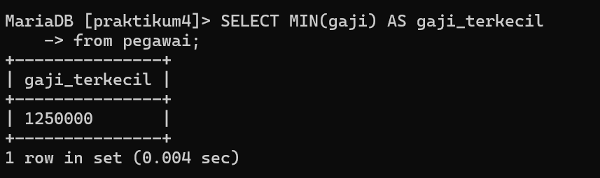
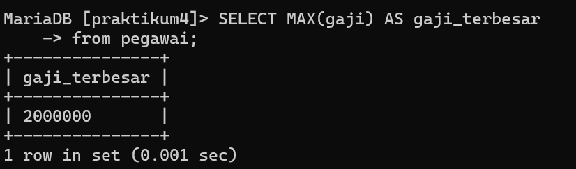
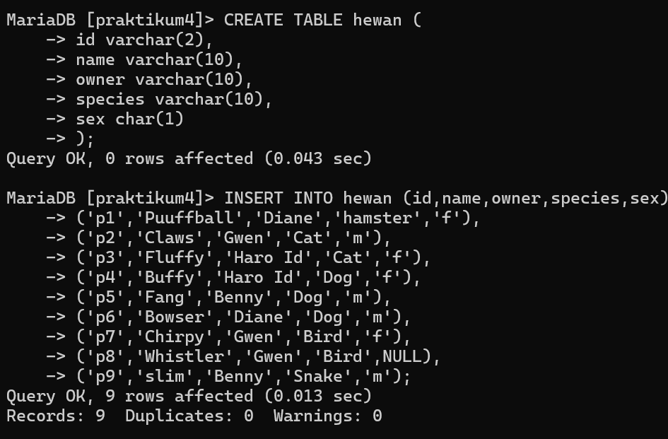

## praktikum4


```
Nama    : Habib Suprayoga
NIM     : 312310608
Kelas   : TI.23.A6
Matkul  : Basis Data
Dosen   : Agung Nugroho, S.Kom., M.Kom.
```

## Query Filtering

## membuat table terlebih dahulu

Berikut adalah contoh pembuatan tabel pegawai beserta isinya menggunakan kode SQL:

```sql
CREATE TABLE pegawai (
  idpegawai VARCHAR(10),
  nama_depan VARCHAR(50),
  nama_belakang VARCHAR(50),
  email VARCHAR(100),
  telepon VARCHAR(15),
  tgl_kontrak DATE,
  id_job VARCHAR(10),
  gaji INT,
  tunjangan INT
);

INSERT INTO pegawai (idpegawai, nama_depan, nama_belakang, email, telepon, tgl_kontrak, id_job, gaji, tunjangan) VALUES
("E001", "Ferry", "Gustiawan", "ferry@gmail.com", "07117059004", "2005-09-01", "L001", 2000000, 500000),
("E002", "aris", "ganiardi", "aris@gmail.com", "07117059008", "2006-03-28", "L002", 2000000, 200000),
("E003", "faiz", "ahnad", "faiz@yahoo.com", "07117059234", "2006-10-01", "L003", 1500008, NULL),
("E004", "enna", "bunton", "enna@yahoo.com", "07117059567", "2004-03-19", "10004", 1500000, 9),
("E005", "mike", "Scoof", "mike@gmail.com", "07117059789", "2007-09-01", "L005", 1250000, 9),
("E006", "lincoln", "burrows", "linc@yahoo.com", "07117059789", "2008-09-01", "L006", 1750000, NULL);
```


berikut hasil outputnya :



1. Untuk menampilkan pegawai yang gajinya bukan 2.000.000 dan 1.250.000, Anda dapat menggunakan perintah SQL SELECT dengan klausa WHERE dan operator NOT IN. Berikut adalah contoh kode SQL untuk melakukan hal tersebut:

```sql
SELECT *
FROM pegawai
WHERE gaji NOT IN (2000000, 1250000);
```


berikut hasil outputnya:


2. Untuk menampilkan pegawai yang tunjangannya NULL, Anda dapat menggunakan perintah SQL SELECT dengan klausa WHERE dan operator IS NULL. Berikut adalah contoh kode SQL untuk melakukan hal tersebut:

```sql
SELECT *
FROM pegawai
WHERE tunjangan IS NULL;
```


berikut hasil outputnya :




3. Untuk menampilkan pegawai yang tunjangannya tidak NULL, Anda dapat menggunakan perintah SQL SELECT dengan klausa WHERE dan operator IS NOT NULL. Berikut adalah contoh kode SQL untuk melakukan hal tersebut:

```sql
SELECT *
FROM pegawai
WHERE tunjangan IS NOT NULL;
```


berikut hasil outputnya :




4. Untuk menampilkan atau menghitung jumlah baris atau record dalam tabel pegawai, Anda dapat menggunakan perintah SQL SELECT dengan fungsi COUNT. Berikut adalah contoh kode SQL untuk melakukannya:

```sql
SELECT COUNT(*) AS jumlah_pegawai
FROM pegawai;
```


berikut hasil outputnya:




5. Untuk menghitung jumlah total gaji di tabel pegawai, Anda dapat menggunakan perintah SQL SELECT dengan fungsi agregat SUM. Berikut adalah contoh kode SQL untuk melakukannya:

```sql
SELECT SUM(gaji) AS total_gaji
FROM pegawai;
```


berikut hasil outputnya :




6. Untuk menghitung rata-rata gaji pegawai, Anda dapat menggunakan perintah SQL SELECT dengan fungsi agregat AVG. Berikut adalah contoh kode SQL untuk melakukannya:

```sql
SELECT AVG(gaji) AS rata_gaji
FROM pegawai;
```


berikut hasil outputnya: 




7. Untuk menampilkan gaji terkecil dari tabel pegawai, Anda dapat menggunakan perintah SQL SELECT dengan fungsi agregat MIN. Berikut adalah contoh kode SQL untuk melakukannya:

```sql
SELECT MIN(gaji) AS gaji_terkecil
FROM pegawai;
```


berikut hasil outputnya :




8. Untuk menampilkan gaji terbesar dari tabel pegawai, Anda dapat menggunakan perintah SQL SELECT dengan fungsi agregat MAX. Berikut adalah contoh kode SQL untuk melakukannya:

```sql
SELECT MAX(gaji) AS gaji_terbesar
FROM pegawai;
```

Perintah di atas akan mencari nilai

berikut hasil outputnya :




## Tugas peraktikum ke 2

seperti sebelumnya, kita akan membuat tabel terlebih dahulu dengan perintah berikut : 

Berikut adalah skrip SQL untuk membuat tabel "hewan" dan mengisinya dengan data yang diberikan:

```sql
CREATE TABLE hewan (
  id VARCHAR(2),
  name VARCHAR(10),
  owner VARCHAR(10),
  species VARCHAR(10),
  sex CHAR(1)
);

INSERT INTO hewan (id, name, owner, species, sex)
VALUES
  ('p1', 'Puffball', 'Diane', 'Hamster', 'f'),
  ('p2', 'Claws', 'Gwen', 'Cat', 'm'),
  ('p3', 'Fluffy', 'Haro 1d', 'Cat', 'f'),
  ('p4', 'Buffy', 'Haro 1d', 'Dog', 'f'),
  ('p5', 'Fang', 'Benny', 'Dog', 'm'),
  ('p6', 'Bowser', 'Diane', 'Dog', 'm'),
  ('p7', 'Chirpy', 'Gwen', 'Bird', 'f'),
  ('p8', 'Whistler', 'Gwen', 'Bird', NULL),
  ('p9', 'Slim', 'Benny', 'Snake', 'm');
```

Perintah di atas akan membuat tabel "hewan" dengan kolom-kolom yang sesuai, yaitu "id", "name", "owner", "species", dan "sex". Kemudian, perintah INSERT INTO digunakan untuk mengisikan data ke dalam tabel tersebut.

berikut hasil outputnya : 




